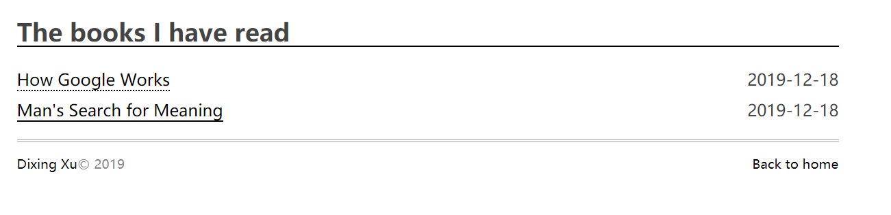

# YAM (yet another minimal)

modified from [polk](https://github.com/chunqiuyiyu/hexo-theme-polk)

## Preview



## Installation

```shell
cd your-blog
git clone https://github.com/dexhunter/hexo-theme-yam themes/yam
```

Modify `_config.yml` in your blog directory and change the value of` theme` to `yam` (the default is` landscape`). At the same time, in order to better display the effect, please change the number of page rendering articles `per_page` to 20 (default is 10).

## Update

```shell
cd themes/yam
git pull
```

## Browser support

- Internet Explorer 9+
- Firefox
- Opera
- Chrome
- Safari
- Edge

## License
[MIT](LICENSE)
